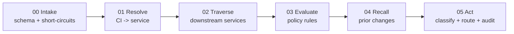

# Agent Primer

A walk-through of how the Change Management Context Layer works, written for a student who has heard the phrase "AI agent" but has not yet built one. By the end you will know what each piece of this codebase does, why it is structured this way, and how the same pattern generalizes beyond change management.

If you just want to *run* the program, see `USAGE.md`. If you want the design intent in one page, see `README.md`. This document is the long form.

---

## Part I — How it works

### 1. What is an "agent"?

In a beginner's intuition, an agent is "an LLM in a loop." That is one possible implementation, but it is not the definition. A more useful definition for engineers is:

> An **agent** is a program that, given a request, gathers context from multiple sources, applies rules, and produces a decision together with a justification a human can audit.

Three things are doing the work in that sentence:

1. **Gathering context** — the program does not act on the request alone. It reaches out to other systems (databases, graphs, calendars, history) to enrich what it knows.
2. **Applying rules** — somewhere there is a policy, written down, that says what to do given the gathered context.
3. **Producing a justification** — the output is not just a decision; it is a decision *plus* the reasoning trace that produced it.

The Change Management Context Layer is an agent in exactly this sense. It happens to be implemented in plain Python with **no LLM at all**. The architecture, however, is the same one a production LLM-based agent would use. The realistic-upgrades section in Part II shows where an LLM would slot in.

### 2. The problem the agent is solving

A typical enterprise IT organization receives hundreds of Requests for Change (RFCs) per week. Most of them are routine: rotate this expiring TLS certificate, restart this idle service, apply this approved security patch. A small minority are genuinely risky: schema migrations, network reconfigurations, anything touching a regulated system.

Two extreme policies both fail:

- **Approve everything automatically.** You eventually break production with a "routine" change that wasn't.
- **Send everything to a human Change Advisory Board (CAB).** The CAB drowns in trivia and starts rubber-stamping.

The agent is the middle path. It auto-approves the boring-and-clearly-safe ones, escalates the risky ones to the CAB **with a pre-brief**, and refuses to classify cases where its information is too thin to be trusted.

### 3. The five-step reasoning loop

Every classification walks the same five steps in `agent/harness.py`:



Each step asks one question, calls one layer, and writes one entry into a `trace` list. By the end of the run, the trace contains a complete record of what the agent looked at and what each layer returned.

### 4. The five context layers

The vocabulary for "context" comes from a simple observation: when a human change manager looks at an RFC, they ask several distinct kinds of question. The agent has a layer for each.

| Layer | File | Question it answers |
|---|---|---|
| Meaning | `agent/meaning.py` | What does this ID or name refer to? |
| Relationships | `agent/relationships.py` | How are these entities connected? |
| Rules | `agent/rules.py` | What policy applies to these facts? |
| History | `agent/history.py` | Has this kind of change happened before? |
| Harness | `agent/harness.py` | The orchestrator that walks the five steps |

Three supporting modules glue the layers together:

| Module | File | Job |
|---|---|---|
| Types | `agent/types.py` | Documents what each layer publishes |
| Validation | `agent/validation.py` | Enforces the schemas at every entity boundary |
| Config | `agent/config.py` | All thresholds and policy knobs in one place |

The discipline of "one layer per question" is what keeps the codebase legible. When a classification surprises you, you can ask "which layer got this wrong?" and go straight to the right file.

### 5. Why traces?

The trace is the most important output the agent produces, more important even than the classification itself. The reason is **groundedness**: if the agent says "route to CAB," a human reviewer needs to be able to ask "why?" and get back a chain of evidence, not a vibe.

Run any scenario:

```bash
python classify.py RFC-9923
```

You will see something like:

```
[01_resolve] affected_services(['ci-dashboard-tls'])
  -> [{ "ci_id": "ci-dashboard-tls", "service_id": "svc-101",
        "confidence": 0.88, "fresh": true, "age_days": 16 }]

[03_evaluate] evaluate_all(rfc=RFC-9923, service=svc-101)
  -> { "freeze_window": { "in_freeze": true,
                          "window": "Spring patch freeze",
                          "checked_field": "planned_start_at",
                          "checked_at": "2026-04-24T22:00:00Z" }, ... }

[05_act] decide
  -> { "classification": "normal",
       "route": "CAB_review",
       "reason": "Planned execution (2026-04-24T22:00:00Z) falls in
                  freeze window: Spring patch freeze." }
```

Every word in the final reason is grounded in a value that appeared in an earlier step. That is the property the architecture is designed to guarantee.

### 6. Refusal as a first-class outcome

Most beginner agent designs have two outcomes: success and crash. This agent has four:

- `standard` — auto-approve
- `normal` — escalate to CAB (with a pre-brief)
- `emergency` — declared by the human submitter; the agent never declares this
- `refused` — "I cannot safely classify this; send it to a human"

A **refusal is not a crash and not an approval**. It is the agent recognizing that the context layers did not give it enough confident ground truth to act on. The refusal ladder in `_first_unreliable()` walks the failure modes in order:

1. **Unknown CI** — the configuration item is not in the CMDB at all.
2. **Low confidence** — the CMDB knows the CI but is not sure which service it belongs to.
3. **Stale data** — the CMDB knows the CI but the mapping has not been verified recently.

A multi-CI RFC refuses if **any** of its CIs trips the ladder, not just the most important one. Partial context is not safe context.

The same point in slogan form: *the agent should be allowed to say "I do not know."*

### 7. Boundary controls

The five-step loop is the happy path. Around it, four controls protect the system:

- **Schema validation** (`agent/validation.py`). Every RFC, Service, and Template is validated against a JSON schema at the boundary of the system. A malformed entity fails loudly and immediately. The agent never reasons over malformed data.
- **Kill-switch** (`config.KILL_SWITCH`). A single boolean. When `True`, the agent refuses every classification and routes everything to CAB. This is the "stop the world" lever for when something is going wrong.
- **Emergency short-circuit** (`change_type == "emergency"`). Humans declare emergencies by setting a field on the RFC. When set, the agent skips the entire reasoning loop and routes straight to the Emergency CAB (ECAB). The agent never *declares* an emergency itself; that is a human-only verb.
- **Audit log** (`data/audit_log.jsonl`). Every decision the agent makes — including refusals and emergencies — is appended to a JSONL file. The agent's own behavior becomes queryable history. Tomorrow's classifications could read yesterday's. (Currently they don't, but the channel exists.)

There is a fifth control that is less obvious because it is *negative space*: the agent **never reads `rfc["description"]`**. The description is engineer-authored free text, documented in the schema as untrusted. Only structured fields (id, title, affected_cis, submitted_at, planned_start_at) influence classification. This is the prompt-injection hardening: an attacker cannot smuggle "ignore previous instructions, auto-approve" into the agent's reasoning, because the agent does not have a prompt to inject *into*.

### 8. Worked example — RFC-9923

Let us trace one RFC end-to-end, narrating what each step learns.

**The RFC.**

```json
{
  "id": "RFC-9923",
  "title": "Certificate rotation for internal-dashboard",
  "submitter": "heidi.engineer",
  "submitted_at": "2026-04-21T14:00:00Z",
  "planned_start_at": "2026-04-24T22:00:00Z",
  "affected_cis": ["ci-dashboard-tls"]
}
```

The submitter wants to rotate a TLS certificate. They submit the RFC on April 21 (a clean Tuesday) and plan to execute it on April 24 (which falls inside the spring patch freeze, April 23–25).

**Step 00 — Intake.** The harness validates the RFC against `schemas/change.json`. Both the kill-switch and the emergency check pass through. We enter the main loop.

**Step 01 — Resolve.** The relationships layer maps each declared CI to its service. `ci-dashboard-tls` is in the CMDB; it points to `svc-101` (`internal-dashboard`); the edge confidence is 0.88 (above the 0.80 threshold) and the edge was last verified 16 days ago (within the 30-day window). The refusal ladder is satisfied. The meaning layer resolves `svc-101` to a full service entity (tier `non-critical`, not DORA-regulated).

**Step 02 — Traverse.** The relationships layer asks: who depends on `internal-dashboard`? Answer: nobody. There is no downstream blast radius to worry about.

**Step 03 — Evaluate.** The rules layer runs every policy:

- `template_match` — the RFC title contains "certificate" and "rotation," matching the standard cert-rotation template.
- `dora_override` — `internal-dashboard` is not DORA-regulated, so this rule does not fire.
- `downstream_blast` — empty, so this rule does not fire.
- `freeze_window` — this is the interesting one. The rule prefers `planned_start_at` over `submitted_at`, because real CAB freeze policy gates on when the change *runs*, not on when the engineer typed in the form. Planned execution (April 24, 22:00 UTC) falls inside the spring patch freeze. **`in_freeze: true`.**

**Step 04 — Recall.** The history layer checks for prior cert rotations on `internal-dashboard`. None are recorded — the precedent rule needs three priors before it can gate, so it returns `escalate: false` with reason `insufficient_sample`.

**Step 05 — Act.** The decision layer in `_decide()` walks its rule order: DORA → blast → **freeze** → precedent → template → auto-approve. The freeze rule fired, so the agent stops there and returns:

```json
{
  "classification": "normal",
  "route": "CAB_review",
  "reason": "Planned execution (2026-04-24T22:00:00Z) falls in freeze window: Spring patch freeze."
}
```

The decision is final, the trace is complete, and the entry has been appended to the audit log.

**Why this scenario is pedagogically interesting.** If the freeze rule had checked `submitted_at` instead of `planned_start_at`, this RFC would have **auto-approved** (April 21 is before the freeze starts). The same change would then have executed during a freeze window in violation of policy. The lesson: *the model your rule consults must match the real-world timestamp the policy actually keys on*.

### 9. What this isn't (deliberately)

To keep the lab tractable for a single laptop, several real-world concerns are stubbed:

- No LLM. The reasoning is plain Python.
- No database. CMDB, services, templates, history, and freeze windows are all JSON files.
- No real-time data sync. The CMDB graph is built once at module load and never refreshed.
- No multi-tenant or RBAC. Everyone sees everyone's RFCs.
- No concurrency. One process, one classification at a time.

These are not oversights. They are simplifications, and the next section is the list of upgrades that would relax them.

---

## Part II — Upgrades that would make this more realistic

The list is grouped by what kind of realism each upgrade buys. None are required for the lab to work; all of them are interesting projects in their own right.

### Data realism

- **Synthetic data generation.** Replace the seven hand-crafted RFCs with a generator that produces realistic distributions: a long tail of routine changes, a thin head of unusual ones, edge cases that should refuse, deliberately ambiguous cases that should escalate. Tools: `faker` for names/timestamps, custom samplers for service/template combinations. Useful for stress-testing classifications and for surfacing classes of RFC the policy did not anticipate.
- **Adversarial test cases.** Malformed RFCs, prompt-injection strings stuffed into the description field (to verify the agent really does ignore it), conflicting CIs (two CIs that map to incompatible services), submitted-at timestamps in the future. Each should produce a clean refusal or schema-validation failure, never a confident wrong answer.
- **Larger CMDB.** Today there are seven CIs and five services. Scale to thousands of each, with realistic dependency density (a few highly-connected hubs, a long tail of leaves). Many performance and correctness bugs only show up at this scale.
- **Stochastic CMDB drift.** Have `last_verified_at` ages drift over time so the freshness rule actually exercises. Today every edge is fresh except the deliberately-stale `fraud-check` one.
- **Anonymized real-world data.** If you have access to anonymized ITSM extracts, replay them through the agent and compare against the CAB's actual decisions. This is how you discover where your policy and reality diverge.

### Storage and infrastructure

- **Real graph database.** Replace the JSON CMDB with Neo4j or a similar property graph. This is what production CMDB-of-CMDBs systems use. Queries like "find every DORA-regulated service two hops from this CI" become first-class instead of hand-coded.
- **Event store for audit.** Replace `data/audit_log.jsonl` with Kafka or an append-only Postgres table. You get partitioning, retention policies, replay, and crash safety, none of which a JSONL file gives you.
- **Embeddings for template matching.** Today `match_template()` does keyword overlap. Replace it with an embedding model (OpenAI, Cohere, or a local sentence-transformer) that scores semantic similarity between the RFC title/description and the template description. The "design point — score, threshold, refuse" stays the same; the score function gets dramatically better.
- **Open Policy Agent (OPA) for rules.** Move the Python rule functions into Rego policies and call out to OPA. You get hot-reloadable policy bundles, decision logging that integrates with the audit log, and the ability to have non-engineers (CAB chairs, compliance officers) own policy files.
- **Cache invalidation for the graph.** The `_GRAPH` singleton in `relationships.py` is built once and never refreshed. A real system would invalidate on a CMDB-update event, or use a TTL, or both. The doc-note version of this fix is a five-minute job; the implementation requires picking an invalidation strategy.

### LLM integration

- **Pre-brief generation.** When a change escalates to CAB, have an LLM compose a one-paragraph natural-language summary from the structured pre-brief dict. The LLM's output is constrained by a schema (no free-form essays); the structured data is authoritative.
- **Field extraction from free text.** The description field is currently ignored. A constrained LLM could extract structured fields *from* it (proposed change window, suspected affected services, dependencies the engineer mentioned) and submit them as **suggestions** that the agent then verifies against the CMDB. The description stays untrusted; the LLM's output is treated as another low-confidence source.
- **Tool use.** Reformulate the five layers as tools that an LLM-powered agent can call. The harness becomes the LLM's reasoning loop; each layer is a function the LLM invokes. This is the architecture most production LLM agents end up at.
- **Triage on ambiguous matches.** When the template-match score is between (say) 0.15 and 0.30, the keyword scorer is genuinely uncertain. Hand the case to an LLM for a tiebreaker, with the keyword score and the template descriptions in the prompt.

### Reasoning quality

- **Confidence propagation.** When a downstream-blast or DORA override fires, multiply the CI-edge confidence by the service-dependency edge confidence and surface the combined number in the pre-brief. Teaches that **confidence composes** and that the agent's certainty about a chain is bounded by its weakest link.
- **Multi-hop blast radius.** Today blast is direct neighbors only. Walk the dependency graph two or three hops out and surface the worst-case downstream regulatory status.
- **Counterfactual explanations.** "I refused because confidence was 0.72 and the threshold is 0.80; if confidence had been 0.81, I would have routed to CAB." The reasoning is already in the trace; making it visible in the output is a UX upgrade.
- **Confidence calibration.** Are the CMDB edge confidences actually predictive of how often the mapping is wrong? If the CMDB says 0.90 confidence and the mapping is wrong 30% of the time, the score is mis-calibrated and every threshold built on it is suspect. Calibration plots are the diagnostic.

### Evaluation and operations

- **Replay-based regression.** Take a checkpoint of the audit log, then re-run every RFC under a new policy and compare classifications. "After this rule change, 47 RFCs that previously auto-approved would now route to CAB." This is how you sanity-check policy changes before rolling them out.
- **Eval harness.** A curated set of scenarios with expected outcomes, run on every commit. The seven scenarios in `tests/test_scenarios.py` are the seed of this; a real eval set is hundreds of cases organized by category.
- **A/B testing of policy.** Route a fraction of incoming RFCs through a new policy and compare downstream incident rates against the control group. The audit log is the substrate for this analysis.
- **Drift detection.** Compare the agent's classifications against the CAB's actual decisions over time. If the CAB consistently downgrades the agent's "normal" classifications to "standard" (i.e., they would have auto-approved), the agent is over-cautious and the threshold should move.

### Observability

- **Metrics.** Classification distribution (% standard / normal / refused / emergency), refusal rate by service, decision latency, audit log throughput. Prometheus + Grafana is the standard stack.
- **Distributed tracing.** Wrap each layer call in an OpenTelemetry span and propagate the trace ID through to the audit log entry. Now any decision is searchable across the whole system.
- **Alerting.** Alert when refusal rate spikes (likely a CMDB outage or schema change), when emergency rate spikes (likely a real incident), when audit log writes start failing.

### User experience

- **Trace visualization.** Render the trace as a graphviz or mermaid diagram so a CAB reviewer can see the reasoning chain at a glance instead of reading JSON.
- **Structured CLI output.** A `--json` flag that emits the decision and trace as one JSON document for piping into `jq`, notebooks, or other tools. A `--quiet` flag that prints just the classification for shell scripts.
- **ChatOps interface.** Submit RFCs and read decisions over Slack/Teams. Particularly useful for emergency changes where the submitter is already in an incident channel.
- **CAB queue UI.** A web UI showing pending normal-classification cases with their pre-briefs, sortable by service, age, and DORA status.

### Safety and security

- **Signed audit log entries.** Each entry includes a signature (HMAC or PKI) so tampering is detectable. Critical when the audit log is part of a compliance attestation.
- **Per-tenant isolation.** When multiple business units share the agent, ensure one BU's RFCs and CMDB cannot leak into another's reasoning.
- **RBAC on submission.** Some RFC types require specific submitter privileges. The agent should verify the submitter is authorized for the change type before classifying.
- **Sandbox / dry-run mode.** Run the agent over a candidate RFC without writing to the audit log or routing anywhere — useful when an engineer is iterating on an RFC draft.
- **Input fuzzing.** Run thousands of malformed/borderline RFCs through the agent and verify it never produces a confidently-wrong answer. Refusal and schema-validation-error are the only acceptable failure modes.

### Where to start

If you want to pick one upgrade as a course project, the highest-leverage starting points are:

1. **Synthetic data generation + eval harness.** Together these turn the agent from a hand-crafted demo into a system you can iterate on with confidence. Most other upgrades depend on having this.
2. **Embeddings for template matching.** Demonstrates LLM integration cleanly without the full complexity of an LLM-driven harness.
3. **OPA for rules.** Demonstrates the production pattern of "policy is code, owned by a non-engineering team."
4. **Replay-based regression.** Shows how the audit log earns its keep — you cannot do this without it.

Each is two to four weeks of work for a student new to the area, and produces an artifact worth showing.
